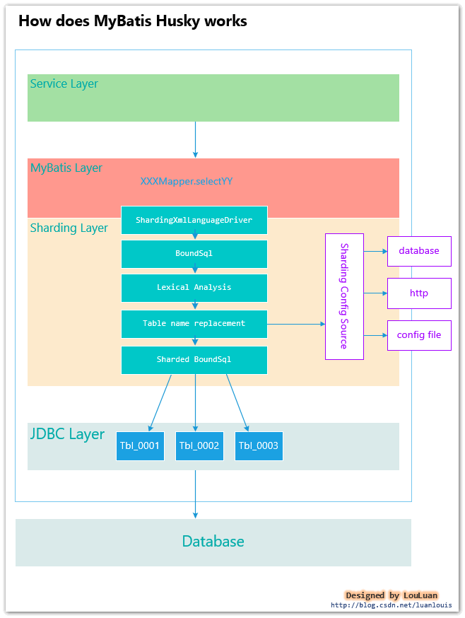

## MyBatis - Husky
**MyBatis Husky** is  a lightweight and efficient table sharding middleware implemented by extending MyBatis `LanguageDriver`
(基于MyBatis LanguageDriver 拓展实现的轻量级高效的水平分表中间件) 

### What does it do ?
MyBatis Husky extends MyBatis `LanguageDriver` to wrap dynamic generated SQL Statements, and then parse the SQL Statements as lexical SQL AST tree, replace the `Table` nodes according to sharding rules , then return the sharding SQL statements.

Because of parsing and replacement actions happens above JDBC layer,it's transparent to JDBC layers.  





### Version
```xml
<dependency>
    <groupId>com.luanlouis</groupId>
    <artifactId>mybatis-husky</artifactId>
    <version>*latest-version*</version>
</dependency>
```

### Dependencies
```xml
<dependencies>
   <dependency>
      <groupId>org.springframework</groupId>
      <artifactId>spring-context</artifactId>
      <version>${spring.version}</version>
   </dependency>
   <dependency>
      <groupId>org.springframework.boot</groupId>
      <artifactId>spring-boot-autoconfigure</artifactId>
      <version>${spring-boot.version}</version>
   </dependency>
   <dependency>
      <groupId>org.mybatis.spring.boot</groupId>
      <artifactId>mybatis-spring-boot-autoconfigure</artifactId>
      <version>${mybatis-spring.version}</version>
   </dependency>
   <dependency>
      <groupId>org.mybatis</groupId>
      <artifactId>mybatis-spring</artifactId>
      <version>${mybatis-spring.version}</version>
   </dependency>
   <dependency>
      <groupId>org.mybatis</groupId>
      <artifactId>mybatis</artifactId>
      <version>3.4.6</version>
   </dependency>
   <!-- use the druid parser utility -->
   <dependency>
      <groupId>com.alibaba</groupId>
      <artifactId>druid</artifactId>
      <version>1.1.14</version>
   </dependency>
</dependencies>
```

### Configuration
Step1. Download the sources,then execute maven command to install it to local repository.
```shell
mvn clean install
```

Step2. Create `sharding rule` table into your database.
```mysql

create table if not exists t_sharding_table
(
	SHARDING_ID int auto_increment primary key,
	SHARDING_NAME varchar(100) null comment '分表名称',
	TABLE_NAME varchar(100) null comment '表名',
	STRATEGY int null comment '替换策略，0：表达式匹配，返回静态分表值；1：表达式匹配，返回动态分表值，这种方式分表参数作为POSTFIX;2:完全自定义实现',
	EXPRESSION varchar(1024) null comment '正则表达式，按照逗号隔开，满足条件，则使用此分表策略',
	DELIMITER varchar(20) default '_' null comment '分隔符,默认下划线',
	POSTFIX varchar(100) null comment '后缀匹配值',
	CUSTOM_IMPL varchar(2048) null comment '自定义策略实现类，指向class完全类名，自动初始化和实例化，当strategy = 2 时，此处有值',
	PRECEDENCE int null comment '匹配优先级，值越小，标识优先级越大'
);

```


Step3. Customize MyBatis configurations
```properties
## set customized ShardingXmlLanguageDriver to override the default one
mybatis.configuration.default-scripting-language=com.luanlouis.mybatis.sharding.drivers.ShardingXmlLanguageDriver
## sharding identifier that can be used to extract from parameter Object
mybatis.configuration.variables._SHARDING_IDENTIFIER_KEY=tenantId
## where to load sharding rule configuration
mybatis.configuration.variables._SHARDING_CONFIG_SOURCE=DATASOURCE
## if above source is configured as `DATASOURCE`,then this value should be configured the bean id in spring context
mybatis.configuration.variables._SHARDING_CONFIG_DATASOURCE=primaryDataSource
```


### Compatibility

Feel free use it with `mybatis-pagehelper`,`sharding sphere` and `seata`


